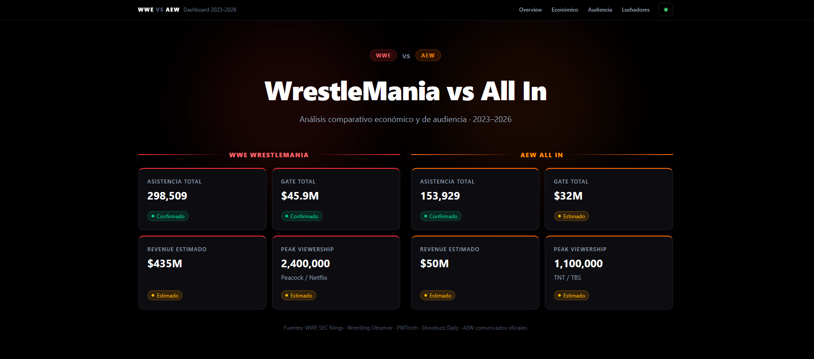
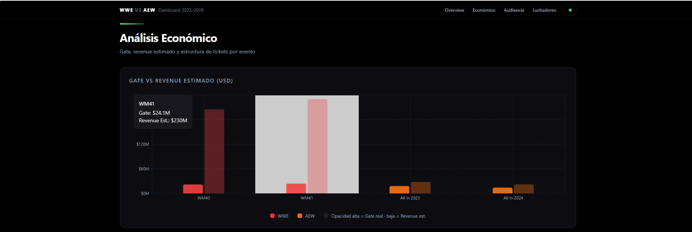
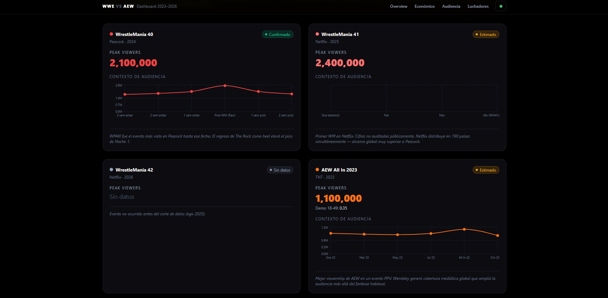
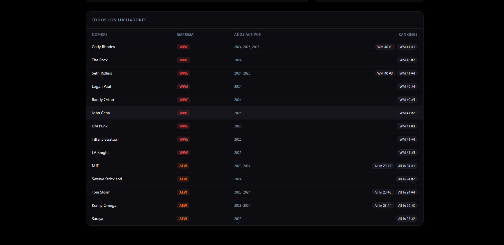

# WWE vs AEW — Dashboard Analítico

Dashboard comparativo de alto nivel para analizar y contrastar métricas económicas, de audiencia y de merchandising entre los eventos principales de **WWE (WrestleMania)** y **AEW (All In)** desde 2023 hasta 2026.

> 🌐 **Demo en producción:** [dashboard-comparativo-wwe-aew.vercel.app](https://dashboard-comparativo-wwe-aew.vercel.app/)  
> 🖥️ **Backend API:** Northflank (`https://site--wrestling-api--qd6hnmpb5l7w.code.run`)

---

## Capturas

| Hero | Análisis Económico |
|---|---|
|  |  |

| Audiencia & Viewership | Luchadores & Merch |
|---|---|
|  |  |

---

## Tabla de Contenidos

- [Stack Tecnológico](#stack-tecnológico)
- [Arquitectura](#arquitectura)
- [Características](#características)
- [Instalación y Ejecución Local](#instalación-y-ejecución-local)
- [API REST](#api-rest)
- [Estructura de Datos](#estructura-de-datos)
- [Capturas](#capturas)
- [Despliegue](#despliegue)
- [Mantenimiento de Datos](#mantenimiento-de-datos)
- [Roadmap](#roadmap)

---

## Stack Tecnológico

### Backend

| Tecnología | Versión | Propósito |
|---|---|---|
| **Node.js** | ≥18 | Entorno de ejecución |
| **Express** | 4 | Framework HTTP |
| **Helmet** | — | Headers de seguridad |
| **express-rate-limit** | — | Rate limiting (300 req / 15 min / IP) |
| **CORS** | — | Control de acceso cross-origin |
| **JSON estáticos** | — | Almacenamiento de datos (sin base de datos) |

### Frontend

| Tecnología | Versión | Propósito |
|---|---|---|
| **React** | 19 | UI components |
| **Vite** | 8 | Bundler y dev server |
| **Tailwind CSS** | 4 | Estilos utilitarios |
| **Recharts** | 3 | Visualización de gráficos |

---

## Arquitectura

```
wwe-aew-dashboard/
├── package.json                 # Scripts de orquestación
├── AGENTS.md                    # Guía para asistentes de IA
├── CLAUDE.md                    # Guía para Claude Code
├── screenshot-*.png             # Capturas para README
│
├── backend/
│   ├── package.json
│   ├── data/
│   │   ├── events.json          # Eventos principales
│   │   ├── matches.json         # Carteleras
│   │   ├── tickets.json         # Estructura de tickets
│   │   ├── viewership.json      # Datos de audiencia
│   │   └── wrestlers.json       # Perfiles de luchadores
│   └── src/
│       └── index.js             # API REST (archivo único, ~340 líneas)
│
└── frontend/
    ├── package.json
    ├── vite.config.js            # Proxy /api → localhost:3001
    ├── src/
    │   ├── api/
    │   │   └── wrestling.js      # Cliente HTTP unificado
    │   ├── components/
    │   │   ├── KpiCard.jsx       # Tarjeta de KPI
    │   │   ├── ConfidenceBadge.jsx # Badge de confianza del dato
    │   │   └── SectionHeader.jsx # Encabezado de sección
    │   ├── sections/
    │   │   ├── HeroSection.jsx   # KPIs comparativos
    │   │   ├── EconomicSection.jsx # Análisis económico
    │   │   ├── ViewershipSection.jsx # Audiencia
    │   │   └── WrestlersSection.jsx # Luchadores y merch
    │   ├── App.jsx
    │   └── index.css              # Variables de tema (dark/light)
    └── public/
```

**Principios de diseño:**

- **Sin base de datos** — backend de solo lectura sobre archivos JSON con `require()`.
- **Confianza del dato como concepto de primera clase** — cada métrica incluye `*_confidence` (`confirmed` / `estimated` / `no_data`) y `*_source` desde el JSON hasta el renderizado.
- **Tema persistente** — modo `dark` / `light` guardado en `localStorage`, con paleta "Whiskey Dark" para el modo claro.

---

## Características

### 🎯 Hero — Comparativa Head-to-Head

- KPIs agregados de **WWE WrestleMania** vs **AEW All In** lado a lado
- Asistencia total, gate, revenue estimado y peak viewership
- Badges de confianza del dato en cada métrica

### 📊 Análisis Económico

- **Gráfico de barras** Gate real vs Revenue estimado por evento
- **Gráfico de asistencia** con ocupación y capacidad
- **Tabla detallada** con todos los eventos, confianza y botón para expandir tickets
- **Desglose de tickets** con pie chart por categoría de precio, precio promedio y estado sellout

### 📺 Audiencia & Viewership

- Peak viewers históricos por evento
- **Nota metodológica** sobre comparabilidad Netflix (horas vistas) vs Nielsen (concurrentes)
- Tarjetas por evento con minigráfico de contexto semanal/mensual de audiencia
- Demo rating 18-49 cuando está disponible

### 👤 Luchadores & Merch Rankings

- **Selector de evento** para filtrar top sellers
- Rankings de merchandising con gráfico de barras invertido
- **Spotlight del top vendedor** con items de merch y resultados de apariciones
- Tabla completa de todos los luchadores con rankings por evento

### 🎨 UI/UX

- Tema oscuro por defecto con modo claro "Whiskey Dark"
- Navegación sticky con scroll suave por sección
- Spinners de carga en cada sección mientras se resuelven los datos
- Footer con fuentes y corte temporal de datos

---

## Instalación y Ejecución Local

### Requisitos

- Node.js 18+
- npm 9+

### Instalación

```bash
# Clonar el repositorio
git clone <repo-url>
cd wwe-aew-dashboard

# Instalar dependencias del backend
cd backend
npm install

# Instalar dependencias del frontend
cd ../frontend
npm install
```

### Desarrollo (dos terminales)

```bash
# Terminal 1 — Backend (con nodemon, hot-reload)
cd backend
npm run dev
```

```bash
# Terminal 2 — Frontend (con Vite)
cd frontend
npm run dev
```

- **Frontend:** `http://localhost:5173`
- **Backend API:** `http://localhost:3001`

El frontend usa el proxy de Vite configurado en `vite.config.js`, por lo que las llamadas a `/api/*` se redirigen automáticamente al backend sin necesidad de configurar CORS en desarrollo.

### Verificar la API

```bash
curl http://localhost:3001/api/health
```

### Scripts disponibles

| Comando | Descripción |
|---|---|
| `npm run backend` (raíz) | Arranca backend en modo dev |
| `npm run frontend` (raíz) | Arranca frontend en modo dev |
| `npm run start:backend` (raíz) | Backend en producción |
| `npm run dev` (backend) | Backend con nodemon |
| `npm run start` (backend) | Backend con node |
| `npm run dev` (frontend) | Servidor de desarrollo Vite |
| `npm run build` (frontend) | Build de producción → `dist/` |
| `npm run preview` (frontend) | Preview del build |
| `npm run lint` (frontend) | ESLint |

---

## API REST

**Base URL (local):** `http://localhost:3001/api`

### Convenciones de respuesta

| Tipo | Formato |
|---|---|
| Colección | `{ "data": [], "total": N }` |
| Recurso único | `{ "data": {} }` |
| Error | `{ "error": "mensaje" }` |

### Endpoints

| Método | Endpoint | Descripción | Query Params |
|---|---|---|---|
| GET | `/events` | Lista de eventos | `company`, `year` |
| GET | `/events/:id` | Detalle de evento | — |
| GET | `/events/:id/matches` | Cartelera del evento | — |
| GET | `/events/:id/viewership` | Audiencia del evento | — |
| GET | `/events/:id/tickets` | Tickets del evento | — |
| GET | `/matches` | Todas las peleas | `event_id`, `is_main_event` |
| GET | `/viewership` | Todos los registros de audiencia | — |
| GET | `/tickets` | Tickets de todos los eventos | — |
| GET | `/wrestlers` | Todos los luchadores | `company` |
| GET | `/wrestlers/top-merch` | Ranking de merch | `event_id` |
| GET | `/wrestlers/:id` | Detalle de luchador | — |
| GET | `/compare` | Comparativa multi-evento | `events=wm40,allin23` |
| GET | `/summary` | Resumen agregado | `company` |
| GET | `/health` | Health check + lista de rutas | — |

### IDs de eventos disponibles

| ID | Evento |
|---|---|
| `wm40` | WrestleMania 40 (2024) |
| `wm41` | WrestleMania 41 (2025) |
| `wm42` | WrestleMania 42 (2026) |
| `allin23` | AEW All In 2023 |
| `allin24` | AEW All In 2024 |

### Ejemplos de uso

```bash
# Eventos de WWE en 2025
curl "http://localhost:3001/api/events?company=WWE&year=2025"

# Main events de WrestleMania 40
curl "http://localhost:3001/api/matches?event_id=wm40&is_main_event=true"

# Comparar dos eventos
curl "http://localhost:3001/api/compare?events=wm40,allin23"

# Resumen de AEW
curl "http://localhost:3001/api/summary?company=AEW"

# Top merch de All In 2024
curl "http://localhost:3001/api/wrestlers/top-merch?event_id=allin24"
```

---

## Estructura de Datos

Los datos residen en `backend/data/*.json` y se cargan en memoria mediante `require()`.

### events.json

Entidad principal de cada evento con datos económicos y de plataforma.

```json
{
  "id": "wm40",
  "name": "WrestleMania 40",
  "company": "WWE",
  "year": 2024,
  "edition": 40,
  "venue": "Lincoln Financial Field",
  "city": "Philadelphia, PA",
  "country": "USA",
  "capacity": 69796,
  "dates": ["2024-04-06", "2024-04-07"],
  "nights": 2,
  "attendance": 145298,
  "occupancy_pct": 100,
  "gate_usd": 38500000,
  "total_revenue_est_usd": 65000000,
  "gate_confidence": "confirmed",
  "gate_source": "WWE SEC Filing",
  "platform": "Peacock (USA) / Netflix (resto)"
}
```

### Niveles de confianza

| Nivel | Significado | Visual |
|---|---|---|
| `confirmed` | Dato de fuente oficial / auditable | Badge verde |
| `estimated` | Estimación de prensa especializada | Badge ámbar |
| `no_data` | Sin publicación fiable disponible | Badge gris |

## Despliegue

### Backend (Northflank — activo)

```bash
npm install
npm run start
```

| Variable | Valor |
|---|---|
| `PORT` | `3001` (por defecto) |
| `CORS_ORIGIN` | `https://dashboard-comparativo-wwe-aew.vercel.app` |

### Frontend (Vercel — activo)

| Configuración | Valor |
|---|---|
| Framework | Vite |
| Build command | `npm run build` |
| Output directory | `dist` |
| `VITE_API_URL` | `https://site--wrestling-api--qd6hnmpb5l7w.code.run` |

### Alternativas de hosting

- **Backend:** Render, Fly.io, Railway, cualquier VPS
- **Frontend:** Netlify, Cloudflare Pages, AWS S3 + CloudFront

> ⚠️ El backend en Railway está **abandonado** (build roto, sin variables configuradas). Ignorar.

---

## Mantenimiento de Datos

### Agregar un nuevo evento

1. Agregar registro en `events.json`
2. Agregar (o stub con `no_data`) en `tickets.json` y `viewership.json`
3. Opcional: cartelera en `matches.json`
4. Opcional: rankings en `wrestlers.json`
5. **Reiniciar el backend** — `require()` cachea los JSON

### Reglas de consistencia

Los IDs deben mantenerse consistentes entre entidades:

- `events.id` ↔ `tickets.event_id`
- `events.id` ↔ `viewership.event_id`
- `events.id` ↔ `matches.event_id`
- `events.id` ↔ `wrestlers.merch_ranking[].event_id`

---

## Roadmap

- [ ] Validación de esquema JSON (Zod / Ajv)
- [ ] Tests automatizados (API + componentes)
- [ ] Migrar `loadData` de `require()` a `fs.readFileSync` para evitar caché
- [ ] Documentación OpenAPI / Swagger
- [ ] Comparador dinámico de eventos en UI
- [ ] Soporte multi-origen en `CORS_ORIGIN`
- [ ] Más años y eventos históricos
- [ ] Gráfico temporal de evolución año a año

---

<p align="center">
  <sub>Datos con corte agosto 2025 · Fuentes: WWE SEC EDGAR · Wrestling Observer · PWTorch · Showbuzz Daily · AEW comunicados oficiales</sub>
  <br>
  <sub>MIT License</sub>
</p>
